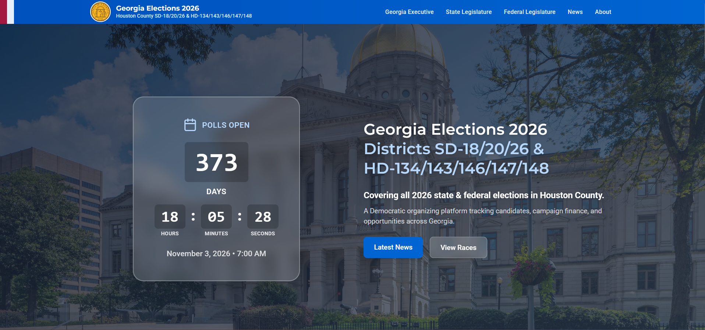
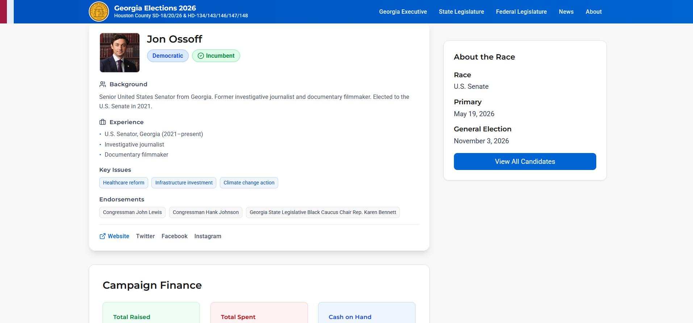
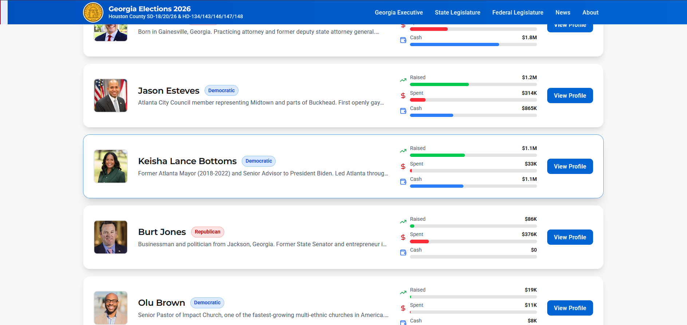
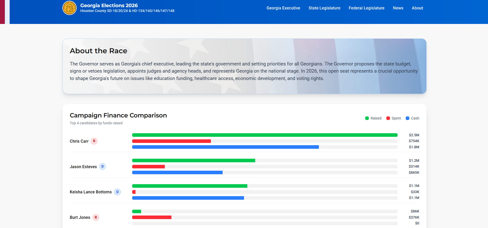
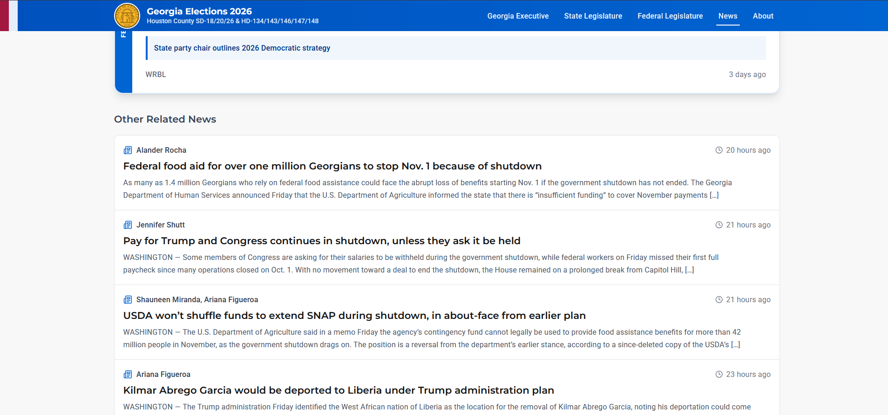
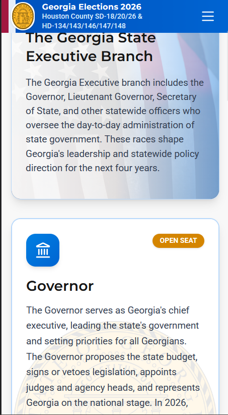

# Georgia Elections 2026

**A grassroots Democratic organizing tool for Georgia's 2026 elections**

[](https://opensource.org/licenses/MIT)
[](https://reactjs.org/)
[](https://www.typescriptlang.org/)
[](https://www.netlify.com/)

## About

Georgia Elections 2026 is a **grassroots organizing hub** built by and for Houston County Democrats. This platform provides progressive voters and organizers with data-driven insights to win in 2026—from statewide open seats to local legislative races.

We're building the tools Democratic organizers need: real-time campaign finance tracking, comprehensive candidate profiles, and resources to mobilize effectively. Georgia proved in 2020-2021 that organizing matters. Let's do it again.

## 🔗 Live Site

**[https://georgia-elections-2026.netlify.app](https://georgia-elections-2026.netlify.app)**
[](https://app.netlify.com/sites/georgia-elections-2026/deploys)

## Screenshots

### Homepage



### Candidate Profile



### Candidate List (on individual race view)



### Campaign Finance Tracking



### News List



### Mobile Responsive Design



Track Georgia's 2026 elections in real-time.

### Key Features

- **Comprehensive Race Coverage**: All major federal and state races in Georgia for 2026, with focus on competitive districts
- **Real-Time Campaign Finance Data**: Track fundraising and spending from OpenFEC (federal) and TransparencyUSA (state)
- **Candidate Profiles**: Detailed profiles for all candidates including backgrounds, policy positions, and campaign information
- **Curated News Aggregation**: Race-specific news feeds from trusted Georgia media outlets
- **Financial Comparisons**: Side-by-side campaign finance comparisons to assess competitive dynamics
- **Mobile-Optimized**: Access organizing data on any device, from canvassing to strategizing
- **Smart Caching**: Intelligent data caching for fast load times while staying current

## Tech Stack

### Frontend

- **React 19.1** - UI framework with React Server Components support
- **TypeScript 5.9** - Type-safe development
- **React Router 7** - Client-side routing with data loading
- **Vite 7** - Fast build tooling and dev server
- **Tailwind CSS v4** - Utility-first CSS framework
- **Framer Motion (motion)** - Smooth page transitions and animations
- **TanStack Query** - Server state management and data fetching
- **Recharts** - Data visualization for financial comparisons
- **Lucide React** - Modern icon library

### Backend & Infrastructure

- **Netlify** - Hosting, serverless functions, and continuous deployment
- **GitHub** - Data repository and version control
- **Node.js** - Serverless function runtime

### Data Sources

- **OpenFEC API** - Federal campaign finance data (US Senate, US House)
- **TransparencyUSA** - State campaign finance data via Python scraper
- **GitHub Data Repository** - Structured JSON files for candidates, races, categories, and news
- **RSS Feeds** - Aggregated Georgia news via Netlify serverless function

## Architecture

The application follows a modern React architecture with clear separation of concerns:

```
src/
├── components/       # Reusable UI components
│   ├── layout/      # Layout components (Header, Footer, RootLayout)
│   └── ui/          # UI primitives (Button, Card, Badge, etc.)
├── features/        # Feature-based modules
│   ├── home/        # Homepage components (Hero, FeaturedRaces, etc.)
│   ├── race/        # Race page components and templates
│   ├── category/    # Category page components
│   └── news/        # News feed components
├── pages/           # Route pages
├── services/        # API services and data fetching
│   ├── dataService.ts            # GitHub data repository
│   ├── openFECService.ts         # Federal campaign finance
│   ├── transparencyUSAService.ts # State campaign finance
│   ├── rssService.ts             # News aggregation
│   └── financialService.ts       # Unified financial data interface
├── hooks/           # Custom React hooks
├── types/           # TypeScript type definitions
├── utils/           # Utility functions (cacheManager, logger, etc.)
└── config/          # Configuration files (API endpoints, cache settings)
```

## Data Sources

### 1. OpenFEC API

Provides federal campaign finance data for US Senate and US House races. Requires a free API key.

- **API Documentation**: https://api.open.fec.gov/developers/
- **Data**: Receipts, disbursements, cash on hand, candidate IDs
- **Cycle**: 2026 election cycle

### 2. TransparencyUSA (State Races)

State-level campaign finance data scraped via automated Python scraper.

- **Scraper Repository**: [ga-elections-26-financial-scrapper](https://github.com/CJohnson0228/ga-elections-26-financial-scrapper)
- **Data Output**: `state-financials.json` in the data repository
- **Automation**: GitHub Actions runs scraper on schedule
- **Coverage**: Governor, Lt. Governor, State Senate, State House

### 3. GitHub Data Repository

Central data repository for all static election data.

- **Repository**: [georgia-2026-election-data](https://github.com/CJohnson0228/georgia-2026-election-data)
- **Contents**:
  - `candidates/` - Individual candidate JSON files
  - `races/` - Race configuration and metadata
  - `news/` - RSS feed configurations and featured articles
  - `financials/` - State campaign finance data
  - `metadata/` - Last updated timestamps

### 4. RSS News Feeds

Aggregated news from Georgia media outlets via Netlify serverless function.

- **Sources**: Georgia Recorder, Atlanta Journal-Constitution, GPB News, etc.
- **Proxy**: Netlify function (`fetch-rss.js`) handles CORS and parsing
- **Filtering**: Tag-based filtering for race-specific news
- **Caching**: LocalStorage cache with configurable TTL

## Setup & Installation

### Prerequisites

- **Node.js**: v18.x or higher
- **npm** or **yarn**: Latest version
- **Git**: For cloning the repository

### Environment Variables

Create a `.env` file in the root directory:

```bash
# OpenFEC API Key (required for federal race data)
# Get your free key at: https://api.open.fec.gov/developers/
VITE_OPENFEC_API_KEY=your_openfec_key_here

# Google Civic Information API Key (OPTIONAL - not currently used)
# Will be needed in v2.0 for polling location finder and ballot lookup
# Get your key at: https://console.cloud.google.com/apis/credentials
VITE_GOOGLE_CIVIC_INFO_API_KEY=your_google_civic_key_here
```

See `.env.example` for reference.

### Installation Steps

1. **Clone the repository**

   ```bash
   git clone https://github.com/CJohnson0228/ga-elections-2026.git
   cd ga-elections-2026
   ```

2. **Install dependencies**

   ```bash
   npm install
   ```

3. **Set up environment variables**

   ```bash
   cp .env.example .env
   # Edit .env with your API keys
   ```

4. **Run development server**

   ```bash
   npm run dev
   ```

   The app will be available at `http://localhost:5173`

5. **Build for production**

   ```bash
   npm run build
   ```

   Production files will be in the `dist/` directory.

6. **Preview production build**
   ```bash
   npm run preview
   ```

## Available Scripts

```bash
npm run dev        # Start Vite dev server with hot reload
npm run build      # Build production bundle (TypeScript + Vite)
npm run preview    # Preview production build locally
npm run lint       # Run ESLint on all TypeScript/React files
```

## Deployment

### Netlify Deployment

The application is deployed on Netlify with automatic deployments from the `main` branch.

**Deployment Configuration** (`netlify.toml`):

- **Build Command**: `npm run build`
- **Publish Directory**: `dist/`
- **Functions Directory**: `netlify/functions/`
- **SPA Redirect**: All routes redirect to `index.html` for client-side routing

**Environment Variables on Netlify**:

1. Go to Netlify Dashboard → Site settings → Environment variables
2. Add `VITE_OPENFEC_API_KEY` with your OpenFEC API key
3. Add `VITE_GOOGLE_CIVIC_INFO_API_KEY` (optional)

**Serverless Functions**:

- `netlify/functions/fetch-rss.js` - RSS feed proxy to avoid CORS issues
- Handles XML parsing and returns structured JSON
- No authentication required

### Manual Deployment

```bash
# Install Netlify CLI
npm install -g netlify-cli

# Login to Netlify
netlify login

# Deploy to production
netlify deploy --prod
```

## Development

### Adding New Candidates

1. Navigate to the [georgia-2026-election-data](https://github.com/CJohnson0228/georgia-2026-election-data) repository
2. Create a new JSON file in `candidates/` directory
3. Follow the candidate schema (see existing files for reference)
4. Add the candidate ID to `candidates/index.json`
5. Commit and push - changes will be live within cache TTL (5 minutes)

### Adding New Races

1. Create a new JSON file in `races/` directory of the data repository
2. Follow the race schema with required fields
3. Add the race ID to `races/index.json`
4. Update `races/raceCategories.json` if adding a new category
5. Commit and push

### Data Update Frequency

- **GitHub Data**: Cached for 5 minutes (configurable in `src/config/cacheConfig.ts`)
- **OpenFEC API**: Cached for 30 minutes
- **RSS Feeds**: Cached for 15 minutes
- **State Financials**: Updated by GitHub Actions scraper (schedule varies)

### Code Organization Principles

- **Feature-based structure**: Related components, hooks, and utilities grouped by feature
- **Type safety**: All data structures defined in `src/types/`
- **Service layer**: Centralized data fetching in `src/services/`
- **Smart caching**: LocalStorage and in-memory caching with TTL
- **Responsive design**: Mobile-first with Tailwind CSS
- **Accessibility**: Semantic HTML, ARIA labels, keyboard navigation

## Contributing

This is a personal project built by C.M. Johnson for Houston County Democrats. However, contributions are welcome!

### How to Contribute

1. Fork the repository
2. Create a feature branch (`git checkout -b feature/amazing-feature`)
3. Commit your changes (`git commit -m 'Add amazing feature'`)
4. Push to the branch (`git push origin feature/amazing-feature`)
5. Open a Pull Request

### Contribution Guidelines

- Maintain TypeScript type safety
- Follow existing code style and ESLint rules
- Test changes locally before submitting PR
- Update documentation if adding new features
- Keep the Democratic organizing mission in mind

### Get Involved

Want to help Houston County Democrats win in 2026? Connect with us:

- **Houston County Democratic Committee**: https://hocodemsga.com
- **Data Updates**: Submit candidate info, news feeds, or corrections via GitHub Issues
- **Tech Support**: Open GitHub Issues for bug reports or feature requests

## License

This project is licensed under the **MIT License** - see the [LICENSE](LICENSE) file for details.

Copyright (c) 2025 Christopher M. Johnson

## Credits

### Built By

**Christopher M. Johnson** (C.M. Johnson)

- Navy veteran
- Aircraft Mechanic
- Self-taught developer

### Data Sources

- **Federal Election Commission (FEC)** - Federal campaign finance data
- **TransparencyUSA** - Georgia state campaign finance data
- **Georgia media outlets** - News coverage via RSS feeds
  - Georgia Recorder
  - Atlanta Journal-Constitution
  - Georgia Public Broadcasting
  - And others

### Special Thanks

- Houston County Democratic Committee for inspiration and support
- OpenFEC for providing free, comprehensive campaign finance data
- Georgia journalists covering state and local politics

## Focus Areas

This project prioritizes:

- **Houston County, Georgia** - Home base for organizing
- **SD-20 (State Senate District 20)** - Competitive state senate race
- **HD-146 (State House District 146)** - Competitive state house race
- **Federal races** - US Senate and US House races affecting Georgia

## Contact

**Houston County Democrats**
Website: https://hocodemsga.com

**Project Repository**
GitHub: https://github.com/CJohnson0228/ga-elections-2026

---

**Built by a Democrat, for Democrats. Let's win in 2026.**
